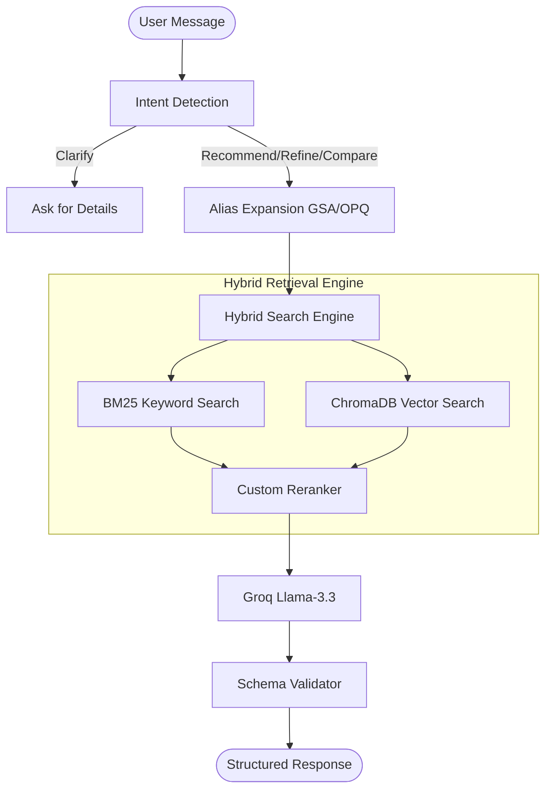

# 🤖 SHL Conversational Assessment Recommender

> **Transforming recruiter intent into grounded SHL assessment recommendations.**

[](https://fastapi.tiangolo.com/)
[](https://groq.com/)
[](https://www.trychroma.com/)
[](https://www.python.org/)

---

## 🌟 Overview

This is an advanced AI-driven conversational API built to assist hiring managers and recruiters in identifying the perfect **SHL Individual Test Solutions**. By leveraging a **Stateless RAG (Retrieval-Augmented Generation)** architecture, the agent provides grounded, accurate, and context-aware recommendations while strictly adhering to the SHL product catalog.

---

## 🏗️ System Architecture

The system uses a sophisticated **Hybrid Retrieval Engine** combined with an **Intent-Aware Dialog Agent**.



---

## ✨ Key Features

### 🔍 1. Hybrid Search Engine
Combines **semantic understanding** (Vector Search) with **keyword precision** (BM25). 
*   **Semantic**: Understands that "cognitive ability" matches "Aptitude" tests.
*   **Keyword**: Instantly finds "Java 8" or "OPQ32r" via exact matching.
*   **Reranking**: Uses a custom keyword-overlap algorithm to ensure the most technical matches appear at the top.

### 🧠 2. Intelligent Dialog Behaviors
*   **Clarification**: Recognizes vague queries like "I need a test" and asks for role/experience details.
*   **Comparison**: Can compare assessments side-by-side using grounded catalog data.
*   **Refinement**: Remembers previous context (e.g., "Add personality tests to that") without storing server-side state.
*   **Alias Expansion**: Automatically handles common acronyms (GSA, OPQ) for better retrieval.

### 🛡️ 3. Safety & Grounding
*   **Zero Hallucinations**: Strictly instructed to only recommend assessments found in the retrieved context.
*   **Refusal Layer**: Politely declines off-topic requests (salary, politics, legal advice).
*   **Individual Tests Only**: Automatically filters out "Job Solutions" and "Bundles" to focus on single assessments.

---

## 🛠️ Tech Stack

*   **Backend**: FastAPI (Python)
*   **LLM Inference**: Groq (Llama-3.3-70b-versatile)
*   **Vector Database**: ChromaDB
*   **Embeddings**: `sentence-transformers/all-MiniLM-L6-v2`
*   **Search Algorithm**: BM25Okapi + Custom Reranking

---

## 📊 Evaluation Metrics

We measure the success of the system using industry-standard RAG metrics:

| Metric | Goal | Description |
| :--- | :--- | :--- |
| **Recall@10** | **>90%** | Probability that the relevant assessment is in the top 10 results. |
| **Schema Accuracy** | **100%** | Strict adherence to the JSON response format. |
| **Behavior Pass Rate** | **High** | Success rate in refusing off-topic queries and clarifying vague ones. |

---

## 🚀 Getting Started

### 1. Installation
```bash
git clone https://github.com/your-username/shl-chatbot.git
cd shl-chatbot
pip install -r requirements.txt
```

### 2. Configuration
Create a `.env` file in the root directory:
```text
GROQ_API_KEY=your_groq_key_here
```

### 3. Execution
```bash
python main.py
```
The API will be live at `http://localhost:8000`. You can access the interactive documentation at `http://localhost:8000/docs`.

---

## 🛣️ API Specification

### `GET /health`
Returns `{"status": "ok"}` for service health monitoring.

### `POST /chat`
The core conversational endpoint.

**Request Body:**
```json
{
  "messages": [
    {"role": "user", "content": "Hiring a Java developer"},
    {"role": "assistant", "content": "What is the seniority level?"},
    {"role": "user", "content": "Senior level"}
  ]
}
```

---

## 📜 License
Internal project for SHL Assessment take-home assignment.
